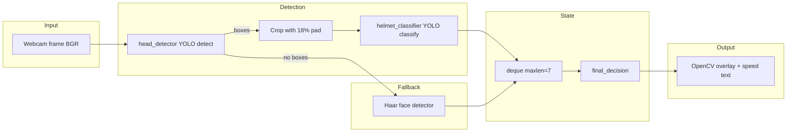

# Architecture Documentation

## System Type

This is a **monolithic, single-process desktop vision application**. It does not follow a client–server or microservices pattern. All logic runs in one Python process on one machine.

---

## High-Level Workflow

1. **Initialize** — Resolve paths to two YOLO weight files; load head detector (detect task) and helmet classifier (classify task); load OpenCV Haar cascade for faces.
2. **Capture loop** — Read one frame from the default camera.
3. **Detect heads** — Run YOLO detection on the full frame; filter boxes below `HEAD_CONFIDENCE` (0.30).
4. **Classify crops** — For each head box, expand by 18% padding, crop, run classifier; map class names to `helmet` or `no_helmet`.
5. **Fallback** — If no head box passed filters, run Haar face detection; any face → treat as `no_helmet` (labeled `face/no_helmet`).
6. **Frame vote** — Append `helmet`, `no_helmet`, or default `no_helmet` to a `deque` of length 7.
7. **Temporal decision** — `final_decision(history)` returns stable label for UI.
8. **Actuate (simulated)** — Set speed 60 or 25 and draw status text.
9. **Display** — `cv2.imshow`; wait 1 ms for key; exit on `q`.
10. **Cleanup** — Release camera and destroy windows.

---

## Data Flow



### Data types (informal)

| Stage | Structure |
|-------|-----------|
| Frame | `numpy` array H×W×3 (BGR) |
| Detection output | Ultralytics `Results` with `.boxes` (xyxy, conf) |
| Classification output | `.probs.top1`, `.probs.top1conf`, `.names` |
| History | `deque` of strings: `"helmet"` \| `"no_helmet"` |
| UI state | `status` string, `speed` int, BGR colors |

---

## API Flow

**Not applicable.** No HTTP endpoints, no authentication tokens, no external service calls during inference (except optional first-time Ultralytics asset download).

---

## Authentication Flow

**Not applicable.** No users, roles, or sessions.

---

## Database Interaction

**Not applicable.** No SQL/NoSQL. Dataset images are **files on disk** used for training documentation only, not loaded at runtime.

---

## State Management

| Mechanism | Scope | Purpose |
|-----------|--------|---------|
| `decision_history` (`deque`, maxlen=7) | Session | Smooth helmet/no-helmet over time |
| Model objects `head_detector`, `helmet_classifier` | Process lifetime | Loaded once at startup |
| Per-frame flags | Single iteration | `frame_has_helmet`, `frame_has_no_helmet`, `head_found` |

There is no Redux, no global app store, and no persistence between runs.

### `final_decision` logic (business rules)

```python
# Simplified behavior:
# - If ≥2 "no_helmet" votes in history → no_helmet (fast path to safety)
# - Else if helmet votes > no_helmet votes → helmet
# - Else → no_helmet (default safe)
```

This biases the system toward **limiting speed** when uncertain.

---

## ML Pipeline Detail

### Stage 1: Head detector

- **File:** `models/head_detector_best.pt`
- **Task:** YOLO object detection (trained on `bike_head_detect_dataset` per project notes)
- **Output:** Bounding boxes around head/helmet region

### Stage 2: Helmet classifier

- **File:** `models/helmet_classifier_best.pt`
- **Task:** YOLO classification on cropped image
- **Classes recognized as helmet:** normalized names in `{"helmet", "withhelmet", "facewithgoodhelmet"}`
- **Everything else:** `no_helmet` (includes bad helmet from original dataset mapping)

### Stage 3: Face fallback

- **Model:** OpenCV `haarcascade_frontalface_default.xml` (bundled with OpenCV)
- **Trigger:** `head_found == False` after detection pass
- **Assumption:** visible face without detected head region ⇒ no helmet

---

## Deployment Structure

| Environment | How it runs |
|-------------|-------------|
| **Review / demo laptop** | `RUN_DEMO.bat` or `python helmet_detection_speed_control.py` |
| **Developer machine** | venv + pip + same script |
| **Target Raspberry Pi** | Not implemented in repo; would need GPIO, Pi camera API, and stripped paths |

No containers, no Kubernetes, no serverless functions are defined.

---

## Folder Responsibilities

| Path | Responsibility |
|------|----------------|
| `helmet_detection_speed_control.py` | Sole runnable application entry point |
| `models/` | Inference weights only |
| `dataset/separate_helmet_dataset/` | Optional local review images (gitignored); not read by runtime demo |
| `docs/` | Human documentation |
| `RUN_DEMO.bat` | Windows launcher |
| `requirements.txt` | Dependency manifest |
| `DATASET_USED_FOR_REVIEW.txt` | Dataset provenance and class mapping |
| `LICENSE` | MIT License |

---

## Application Entry Point

| File | Model resolution | Camera | Notes |
|------|------------------|--------|-------|
| `helmet_detection_speed_control.py` | `BASE_DIR / "models" / ...` only | `VideoCapture(0)` | Used by `RUN_DEMO.bat` |

On Windows, if the default camera backend fails, try `cv2.VideoCapture(0, cv2.CAP_DSHOW)` in the same file.

---

## Performance Characteristics

- **Bottleneck:** Two YOLO inferences per frame (full frame + one or more crops).
- **Typical optimization levers:** smaller model, lower camera resolution, skip frames, TensorRT on Pi, GPU on PC.
- **No batching** across frames; synchronous loop.

---

## Missing Architectural Components (verified gaps)

- Configuration layer (env/YAML)
- Logging service
- Model version registry
- Automated tests
- CI/CD
- Real-time hardware abstraction layer (GPIO)
- Network API for remote monitoring
