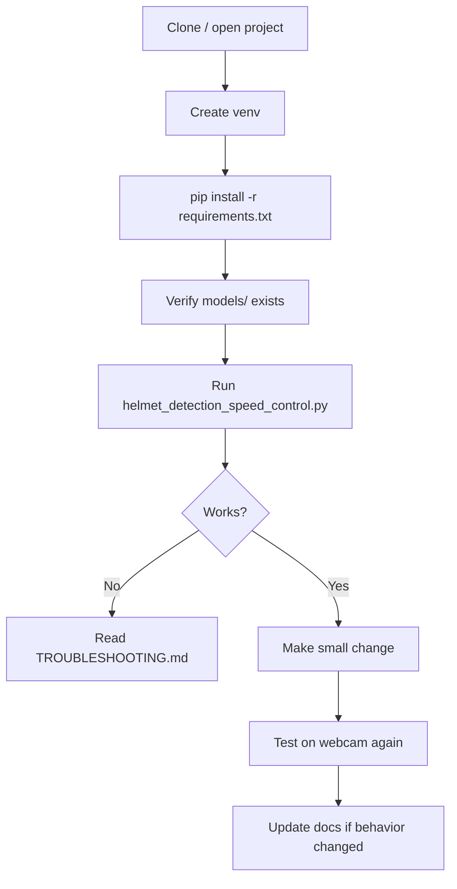

# Development Workflow

How developers work on this project day to day—written for freshers and reviewers.

---

## Recommended Workflow



---

## Daily Development Steps

1. **Activate virtual environment** every new terminal session.
2. **Run the canonical script:** `helmet_detection_speed_control.py` (same as `RUN_DEMO.bat`).
3. **Change one thing at a time** (threshold, label text, camera index).
4. **Watch the OpenCV window** while testing—console logs are minimal (`verbose=False` on YOLO).
5. **Quit with `q`** before rerunning to avoid “camera already in use” errors.

---

## Which File Should I Edit?

| Goal | Edit this |
|------|-----------|
| Demo / review / most users | `helmet_detection_speed_control.py` |
| Windows camera backend issues | Same file — try `VideoCapture(0, cv2.CAP_DSHOW)` |
| Documentation only | `README.md`, `docs/*.md` |
| Dependencies | `requirements.txt` |

---

## How to Add a New Feature

### Example: Log decisions to a CSV file

1. **Plan** — After `final_decision()`, append row: timestamp, decision, speed.
2. **Import** — `import csv`, `from datetime import datetime`.
3. **Open file once** before the `while True` loop (write header).
4. **Append** one row per frame inside the loop.
5. **Test** — Run 10 seconds, press `q`, open CSV in Excel.
6. **Document** — Add row to `docs/FEATURES.md` and README if user-facing.

### Example: Use external USB camera (index 1)

1. Change `cv2.VideoCapture(0)` to `cv2.VideoCapture(1)`.
2. If that fails, try `1` then `2` in a small loop at startup.
3. Document in README “Environment setup”.

### Example: Real Raspberry Pi GPIO speed control

1. Create `hardware/gpio_speed.py` with `set_speed(kmh)` stub.
2. Replace only the block that sets `speed = FULL_SPEED` / `LIMITED_SPEED` with a call to `set_speed`.
3. Keep GUI text for debug until hardware is verified.
4. Test on Pi without motor first (LED on/off).

---

## How to Debug Issues

### 1. Confirm environment

```powershell
python --version
pip show ultralytics opencv-python
dir models
```

### 2. Isolate the camera

```python
import cv2
cap = cv2.VideoCapture(0)
print("opened:", cap.isOpened())
ret, frame = cap.read()
print("read:", ret, frame.shape if ret else None)
cap.release()
```

Save as `scripts/test_camera.py` (create folder if needed).

### 3. Isolate models

```python
from ultralytics import YOLO
from pathlib import Path
m = Path("models/head_detector_best.pt")
print("exists:", m.exists())
model = YOLO(m)
print(model.names)
```

### 4. Lower thresholds temporarily

If nothing is detected:

- Set `HEAD_CONFIDENCE = 0.20`
- Set `CLASS_CONFIDENCE = 0.40`

Revert after debugging to avoid unsafe full-speed grants.

### 5. Enable YOLO verbose mode

Change `verbose=False` to `verbose=True` on one inference call to see timing and shape info.

### 6. Print frame votes

Inside loop, after appending to `decision_history`:

```python
print(list(decision_history), "->", decision)
```

---

## How to Test the Project

This repo has **no automated test suite**. Manual test plan:

| # | Test | Pass criteria |
|---|------|----------------|
| 1 | Cold start | Script starts without `FileNotFoundError` |
| 2 | Camera | Live video visible |
| 3 | With helmet | Green box or helmet label; speed 60 after ~1s stable |
| 4 | Without helmet | Red box or no_helmet; speed 25 |
| 5 | Face only (cover head detector) | `face/no_helmet`, speed 25 |
| 6 | Quit | `q` closes window, returns to shell |
| 7 | Re-run | Second run opens camera without reboot |

### Suggested unit tests (future)

- `normalize_name("Face-With-Good-Helmet!")` → `facewithgoodhelmet`
- `final_decision(deque(["helmet","no_helmet","no_helmet"]))` → `no_helmet`
- `crop_box` does not exceed image bounds

Use `pytest` in a `tests/` folder when added.

---

## Version Control Practices

If using Git:

- **Do not commit** `D:\` or personal `C:\Users\...` paths in new code.
- **Consider Git LFS** for `models/*.pt` and large dataset images.
- Ignore `.venv/`, `__pycache__/`, `.idea/`.

---

## Code Style Conventions in This Repo

- Constants in `UPPER_SNAKE_CASE` at module top
- Functions: `snake_case`
- Type hints in newer copies (`list[Path]`, `str`) but not everywhere
- Minimal comments; behavior is in logic and reviewer txt files

Match existing style when contributing.

---

## Release / Review Package Checklist

Before sending to an examiner:

- [ ] `models/*.pt` present
- [ ] `RUN_DEMO.bat` points to working script
- [ ] `README.md` up to date
- [ ] `DATASET_USED_FOR_REVIEW.txt` matches `helmet_detection_speed_control.py`
- [ ] Capture 2–3 screenshots into `docs/images/` (optional)

---

## Training Workflow (Outside Runtime App)

1. Obtain Roboflow export (`PROJECT_REVIEW_DATASET_archive_2.zip`).
2. Build YOLO detect dataset for heads and classify dataset for helmet/no_helmet (see `DATASET_USED_FOR_REVIEW.txt`).
3. Train with Ultralytics; export `best.pt`.
4. Copy to `models/head_detector_best.pt` and `models/helmet_classifier_best.pt`.
5. Re-run webcam demo and repeat manual test plan.
